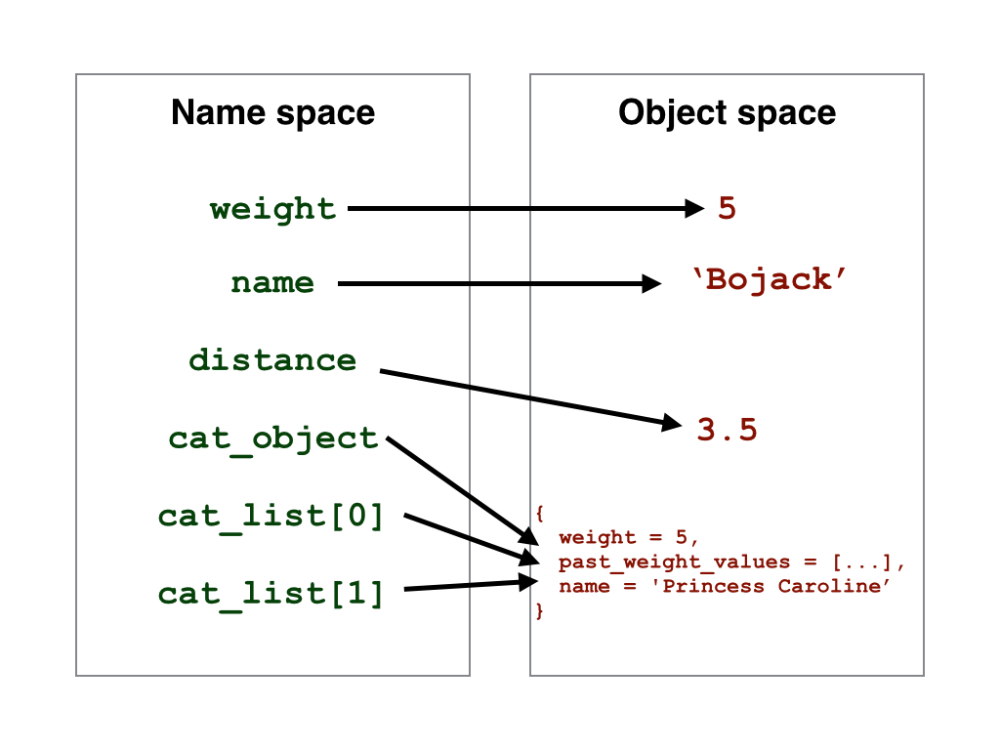

> ## Learning Objectives {.objectives}
>
> * Understand JavaScript data types
> * Converting JavaScript data to JSON format
> * Converting JSON data to JavaScript format

The goal of these lessons is to visualize data. 
So far we haven't really dealt with any specific data, let alone 
relatively big data files.
In this lesson, we will learn about the basic data types used 
by JavaScript and also talk about ways to conveniently convert 
variables into a text file so we can store it.

There are two containers in JavaScript: 
arrays (`[]`-notation) and objects (`{}`-notation).

In order to create a container, we have to declare it 
first using the `var` keyword that we've already come across.

~~~{.js}
var list_of_numbers = [];
~~~ 

creates an array. But so far it’s empty. 

We can now add elements to this array but instead let's create it 
again with some values in it, like this:

~~~{.js}
var list_of_numbers = [30, 2, 5];
~~~

Let's use the console of the browser to look at the values of object
by including some extra code:

~~~{.js}
console.log(list_of_numbers);
~~~

Or we can just address one field of the vector. Counting begins from zero, 
so the third field has the index '2'.

~~~{.js}
console.log(list_of_numbers[2]);
~~~

`list_of_numbers` is a vector that holds 3 numbers. 
We can also have a variable that contains a string:

~~~{.js}
var text = 'I love cats.';
~~~

We can address this string by using indices, so `console.log(text[2])`
returns `l`.

Unlike arrays which allow you to access elements using their indices, 
JavaScript objects allow you to index elements using names. 
This lets us create something like this:

~~~{.js}
var cat_object = {
	weight : 5,
	past_weight_values : [4.5, 5.1, 4.9],
	name : 'Princess Caroline'
};
~~~

> ## Creating new attributes {.challenge}
> You can append the list of attributes using the dot-syntax `cat_object.attributename = ...`,
> (`attributename` is a placeholder). Create a new attribute `height` and assign a number! 

Sometimes we want to have a list of objects that we can address using an index. 
In our case, we might want to have a list of multiple cats. 
Now if we want a second cat, we can store them both in the same array `cat_list`. 
We can append to an array using the `push` function:

~~~{.js}
var cat_list = [cat_object]; // initializing with the first field being cat_object
cat_list.push({weight : 6 , past_weight_values : [5.9, 5.3, 6.1], name : 'Snowball'});
~~~

This process is called 'nesting'.

> # Nesting {.challenge}
> 1. Append a third cat to the array, not entering a name or weight.
> 2. Do all animals have to have the same attribute fields?
> 3. Use the console of your browser to read the values of your object. 

> ## Object space and name space {.challenge}
> Instead of pushing a new cat to the list, what happens if we initiate the list using cat_object twice? 
>
> Reinitialise the list:
>
>~~~{.js}
>var cat_list2 = [cat_object, cat_object]; 
>~~~
> 
> 1. Change the name of the first cat object `cat_list2[0]`. Look at the whole list again (`cat_list2`). What happened?
> 2. Look at cat_object. What's going on??

In Javascript, we have a name space and an object space. 
The name space contains the names of the variables, the object space contains the actual content. 
Normally, you would assume that each name points to one object (`cat_object.weight` --> `5`, `cat_object.name` --> 'Princess Caroline'). What we did, when we created our list is that we used three names to point to the same object (`cat_list[0]`, `cat_list[1]`, `cat_object` --> `{weight = 5 , past_weight_values = [4.5, 5.1, 4.9], name = 'Princess Caroline'}`).
When we changed the name of `cat_list2[0]`, what we actually did was changing the content of the one object `cat_object` that they were all pointing to.

A good way of creating a new array (as in a new object, not just a new 
name for the same one) that relates to an array we already have 
can be done using the `map()` function. 

As an example, we can create a list of dogs that have the same names as 
our cats, only appended by "Doggie ".

~~~{.js}
dog_list = cat_list.map(function(cat) {
	return {
		name: "Doggie "+ cat.name
	};
});
~~~

When the map function is called using `cat_list.map`, it loops through all elements
in `cat_list`, calls each temporarily `cat`, and creates a new list `dog_list`, which
will have one dog per cat. We join the two strings with a simple `+`.

> # How much do dogs weigh? {.challenge}
> Let's assume our dogs weigh twice as much as their feline versions. Make 
> the new array reflect this.

When we start creating our data for the plot, this is the structured 
(and nicely annotated) data format that we want. 
In order to store our variable outside of the scripting environment, we need
to convert it into a string.

JavaScript provides an easy way to do this. Variables can get converted from objects/arrays to strings using `JSON.stringify()`. 
To convert our list of cats to a string, type

~~~{.js}
var cat_json = JSON.stringify(cat_list);
~~~ 

The resulting string is what we would normally store in a `.json` file to 
read it in later. 
At this stage, we can't really create a file, because we're in a browser 
and creating files would make it too easy to program a virus.

So instead, let's have a look at our stringified variable using the `alert()` function:

~~~{.js}
alert(cat_json);
~~~

The output should look like this: 

~~~{.out}
[{"weight":5,"past_weight_values":[4.5,5.2,4.9],"name":"Princess Caroline"},{"weight":6,"past_weight_values":[5.9,5.3,6.1],"name":"Snowball"}]
~~~

We could now copy this string and save it manually in a `.json` file. 

> ## De-stringify  {.challenge}
> Let's assume we read in a JSON formatted string from a file and want to 
> retrieve the nice structure. This process is called parsing and we can 
> use the JSON.parse() function. Convert the variable `cat_json` back and store it in a 
> container called `new_cat_list`.

We are now at a stage where we can have a look at the data file that we 
want to work with. Open 'nations.json'.

Here is a snap-shot of our data. We have data from 10 different countries, describing income per capita, population, and life expectancy for different years between 1800 and 2009.
Source: [gapminder](http://www.gapminder.org/data/)

~~~{.out}
[
  {
    "name": "Angola",
    "region": "Sub-Saharan Africa",
    "years": [
      1950,
      1951,
      1952,
	  ...
    ],
    "income": [
      3363.02,
      3440.9,
      3520.61,
	  ...
	],
    "population": [
      4117617,
      4173095,
      4232095,
	  ...
   	],
    "lifeExpectancy": [
      29.22,
      29.42,
      29.81,
	  ...
	]
  },
  { ... }
]
~~~
