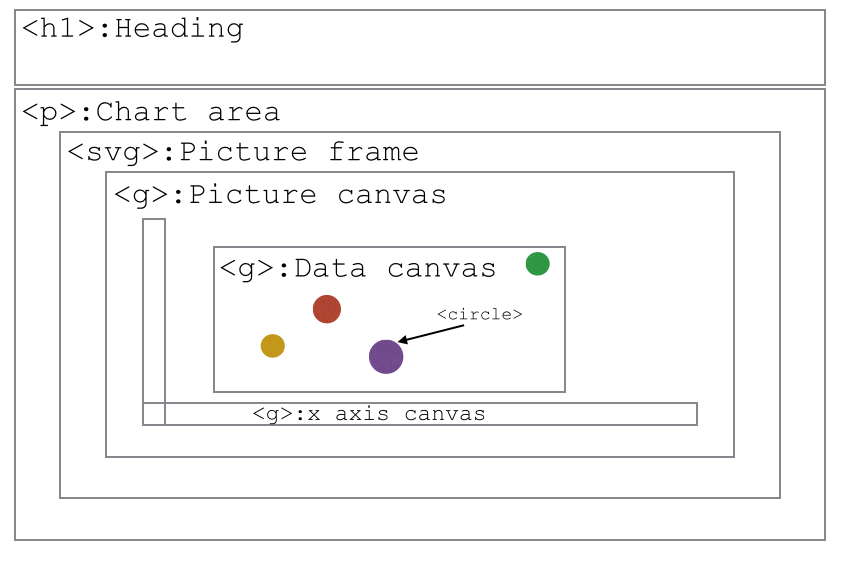

> ## Learning Objectives {.objectives}
> 
> * Setting up an html file to contain the plot
> * Reading in data from a given `.json` file
> * Structuring the html content

We've finally learned everything we need to know to start using D3. 
D3 is a JavaScript library. This means that we can use all of the JavaScript commands that we have already learned, but on top of these, there are a few new functions that will make our life easier.

The main purpose of D3 is to create visualisations of data online. Because it uses JavaScript, it is possible to make graphs interactive! 

As a little refresher, we will repeat a little bit html to set up our page. 

Create `index.html` containing the following:

~~~{.html}
<!DOCTYPE html>
<html>
  <head>
    <meta charset="utf-8">
    <title>The Wealth & Health of the N-Nations</title>
    <link rel="stylesheet" type="text/css" href="main.css" />
  </head>
  <body>

    <h1>The Wealth & Health of the N-Nations</h1>

    

    
    
  </body>
</html>
~~~

There are a few things in this file that look new:
`<link rel="stylesheet" type="text/css" href="main.css" />` is linking the local CSS file `main.css`(that can just be an empty file for now). `` is linking the JavaScript file, the file in which all the action will happen. 

Additionally, we now need to link d3 using ``. The order matters. Since code is executed sequentially and we want to use parts of the D3 library in our own script, we have to link to d3.js first.

The last bit, that's important here is an HTML element (paragraph) we create. We give it an id `chart_area`. This is the area we reserve for our pretty chart. We will use JavaScript (and D3) to fill it in. 

Now, let's write main.js.

Similar to the syntax we've already seen (`JSON.stringify`), D3-specific functions can be called using a `d3.`-syntax.

The first thing we need, is of course our data, which is stored in 'nations.json'.
D3 provides a handy function to read in `json`-files:

~~~{.d3}
d3.json("resources/nations.json", function(nations) { });
~~~

This line probably needs a little explanation and we'll go through it bit by bit: 

* `d3.json()` is called the function call. In this case, we have a function that reads in a json file, parses it, and is also able to do something with the parsed data on the way.
* The first argument `"resources/nations.json"` tells the function where to get the data we want to have parsed.
* `function(...){...}` is called the callback function. It is a so-called 'inline' function, which means it has no name (we're only operating in the object space here). This also means we can't use this function anywhere else in our code. The code we put inside the curly brackets is the code that's run once d3.json() is called and the data is loaded.
* D3 assigns the name `nations` to the parsed object it returns. We can only use 'nations' within the callback function, this means our code only knows of `nations` inside the curly brackets.
* What seems unusual, but is actually quite common, is that this function call doesn't return anything. It is simply executed and displayed (if we tell it to), but no value is returned. 

> ## What else can I read in conveniently? {.callout}
> D3 offers the possibility to also read in csv (comma-separated values) files directly. See [here](https://github.com/mbostock/d3/wiki/CSV) for an example. Also available are functions to read in tab-separated values (tsv) and files with arbitrary delimiter (dsv).

So naturally, the next step is to think about what we want to happen between the curly brackets.
For now, we want to:

* Link JavaScript to HTML page
* Insert an SVG canvas
* Create axes (x: income per capita, y: life expectancy)
* Display data points (scatter plot)

First, let's draw a little schematic of how we want the page to be structured.

We already set up our HTML page to contain a chart area. That's the space we want to 
fill now. 
We'll have a picture frame (an SVG-element), our drawing area (a g-element), and in 
that drawing area, we'll have separate elements for both axes and the area for our circles.

Firt, we need to link the JavaScript and HTML environment so that we have writing access
to the HTML.
To do this, we use the `.select()`. This lets us grab an element by specifying its ID.

~~~{.js} 
// Select the chart area by ID 
var chart_area = d3.select("#chart_area");
~~~

Now we're setting up the grid by appending the chart area by the SVG picture frame.

~~~{.js} 
var frame = chart_area.append("svg");
~~~

This is equivalent to writing:

~~~{.html}

 <svg> </svg> 

~~~

in the HTML file. We chose to append because we now have access to the SVG element without the need to separately select it by ID.

We also create the canvas inside the frame:

~~~{.js}
// Create canvas inside frame.
var canvas = frame.append("g");
~~~

Let's set up the dimensions for our elements that we want to use:

~~~{.js}
// Set margins, width, and height.
var margin = {top: 19.5, right: 19.5, bottom: 19.5, left: 39.5};
var frame_width = 960;
var frame_height = 350;
var canvas_width = frame_width - margin.left - margin.right;
var canvas_height = frame_height - margin.top - margin.bottom;
~~~

...and apply them to the actual elements:

~~~{.js}
// Set frame attributes width and height.
frame.attr("width", frame_width);
frame.attr("height", frame_height);
~~~

The canvas element will have to fit nicely into the frame. To make it fit, we set
a transform attribute and use the translate function. 

~~~{.js}
// Shift the canvas and make it slightly smaller than the svg canvas.
canvas.attr("transform", "translate(" + margin.left + "," + margin.top + ")");
~~~

> # Time for a challenge I think! {.challenge}
> Let us consolidate our understanding of SVGs and D3 selectors.

> 1. Add a circle element to the HTML using the SVG markup we learnt in lesson 3.
> 2. Use `d3.select` to get a reference to the circle.
> 3. Once the circle reference is obtained, make the radius 40px, the border black and the colour green.

> HINT: use the `attr` and `style` methods on the circle object obtained.

