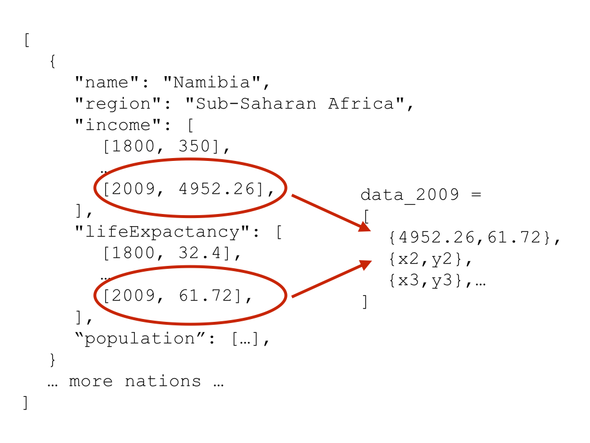

> ## Learning Objectives {.objectives}
> 
> * Making axes
> * Actually plotting data (d3.enter)

We design our axes based on our data. This means we have to know the minimum and 
maximum values of our data and have to decide whether we want linear or logarithmic
axes.

~~~{.js}
// Create a logarithmic scale for the income 
var xScale = d3.scale.log(); // income
xScale.domain([300, 1e5]); // set minimum and maximum value
xScale.range([0, canvas_width]); // set minimum and maximum range on the page
~~~

D3's scale object provides a number of functions to create the scaling we want 
for our data. For example, we can choose between a logarithmic scale (`log`), a 
linear scale (`linear`), a square root scale (`sqrt`), or a categorical scale 
(e.g. `category10` could represent 10 different colours).

The domain is set based on the minimum and maximum values of the data, range is 
the range on the page, basically the range our data gets mapped to.

Instead of spreading this code over three lines, we often find another notation 
online that achieves the same thing:

~~~{.js}
var xScale = d3.scale.log().domain([300, 1e5]).range([0, canvas_width]);  
~~~

These two notations are interchangeable and it is entirely up to you to use the 
one that seems more intuitive to you. 
In the same way that we could switch setting up the domain and range in the more 
verbose notation, we can swap these two in the shorter notation without it making 
any difference. 

The next step is to create the actual axis and linking it to the scale we just 
created:

~~~{.js}
// Creating the x & y axes.
var xAxis = d3.svg.axis().orient("bottom").scale(xScale);
~~~

We also want to orient it horizontally, at the bottom of our canvas.

So far, the xAxis exists, but it's not actually showing up anywhere on the page.
To push the axis to our canvas, we create a new group element (using `.apend`).

~~~{.js}
// Add the x-axis.
canvas.append("g")
.attr("class", "x axis")
  .attr("transform", "translate(0," + canvas_height + ")")
  .call(xAxis);
~~~

`.call` calls the axis we just created and pushed it to the element.
Attributes are added to make the axis look prettier.
We also give it a class, just in case we might want to select the axis later in our code.

FIXME: explain `.attr("transform", "translate(0," + canvas_height + ")")`

> # We might need a y-axis, too {.challenge}
> Create a linear scale for the y-axis, with 10 being the minimum and 85 being the maximum value. Then, add the axis to the canvas.

We're slowly getting there. Having our two axes, we can now finally add our data. 
But we don't want to see all the data at once for now. Let's instead just look at the 
most recent data point (year 2009).

We create a new array `data_2009` that contains only these data points using the `map`
function we've learned about earlier. We are looking at the most recent data point (`[nation.income.length-1]`).

~~~{.js}
// create new array that only contains the most recent data point
var data_2009 = nations.map( function(nation) {
  return {
    x : nation.income[nation.income.length-1][1],
    y : nation.lifeExpectancy[nation.lifeExpectancy.length-1][1]
  }
});
~~~

FIXME: image and mapping might need updating once we've restructured the data.

And now we're ready to add one circle per data point! 

~~~{.js}
var dot = canvas.append("g")
      .attr("class", "data_canvas")
      .selectAll(".dot")
      .data(data_2009) // each of the points has the data_2009 element bound to it.
      .enter()
      .append("circle")
      .attr("cx", function(d) { return xScale(d.x); }) // income
      .attr("cy", function(d) { return yScale(d.y); }) // life expectancy
      .attr("r", 5 );                                  // generic radius (for now)
~~~

We're starting this bit by adding a `g` element to our canvas.
This group is going to be our data canvas, so that's the class name we give it.
We then select everything of the class `dot`. This is an empty set at the moment,
since we haven't created any dots, yet.
We are then telling our page where to find the data, using `.data(data_2009)`.
Now comes the interesting part:
`.enter()` is entering the dataset and does everything after for each of the 
data elements inside the set. 
And what we want to do is to create one circle for each data point. That's
what the last four lines of code do. They are creating a circle, and then setting 
the attributes `cx`, `cy`, and `r`. 
`cx` and `cy` define the position of the circle and are based on the income and life expectancy of the data point (that is temporarily called `d`). The radius is set to an 
arbitrary number... for now.

> # A new dimension {.challenge}
> Change the code so that the radius of the circles represents the population. First, create a sqrt scale with a minimum of 0 and a maximum of 5e8. The range should be between 0 and 40. Also, don't forget to update the mapping function. 