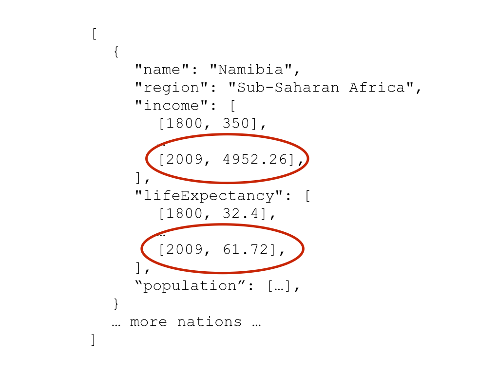

> ## Learning Objectives {.objectives}
> 
> * Making axes
> * Actually plotting data (d3.enter)

We design our axes based on our data. This means we have to know the minimum and 
maximum values of our data and have to decide whether we want linear or logarithmic
axes.

~~~{.js}
// Create a logarithmic scale for the income 
var xScale = d3.scale.log(); // income
xScale.domain([250, 1e5]); // set minimum and maximum value
xScale.range([0, canvas_width]); // set minimum and maximum range on the page
~~~

D3's scale object provides a number of functions to create the scaling we want 
for our data. For example, we can choose between a logarithmic scale (`log`), a 
linear scale (`linear`), a square root scale (`sqrt`), or a categorical scale 
(e.g. `category20` could represent 20 different colours).

The domain consists of the data values that will get mapped to the minimum and maximum positions on the page specified by the range. Often, the domain would be set to the minimum and maximum values of the data and the range to the edges of the plotting area. 

Instead of spreading this code over three lines, we often find another notation 
online that achieves the same thing:

~~~{.js}
var xScale = d3.scale.log().domain([300, 1e5]).range([0, canvas_width]);  
~~~

These two notations are interchangeable and it is entirely up to you to use the 
one that seems more intuitive to you. 
In the same way that we could switch setting up the domain and range in the more 
verbose notation, we can swap these two in the shorter notation without it making 
any difference. 

The next step is to create the actual axis and linking it to the scale we just 
created:

~~~{.js}
// Creating the x & y axes.
var xAxis = d3.svg.axis().orient("bottom").scale(xScale);
~~~

We also want to orient it horizontally, at the bottom of our canvas.

So far, the xAxis exists, but it's not actually showing up anywhere on the page.
To push the axis to our canvas, we create a new group element (using `.append`).

~~~{.js}
// Add the x-axis.
canvas.append("g")
	.attr("class", "x axis")
  .attr("transform", "translate(0," + canvas_height + ")")
  .call(xAxis);
~~~

`.call` calls the axis we just created and pushed it to the element.
We add a transform attribute to move the axis to the bottom of the plotting area (instead of having it across the top). There are a number of transform options, but here we are just using `translate` and pass in the amount to shift the axis in the x and y directions, respectively. Here we shift it only in the y direction (i.e. down) by an amount given by height of the canvas.  
We also give it a class, just in case we might want to select the axis later in our code.

> ## We might need a y-axis, too {.challenge}
> 1. Create a linear scale for the y-axis, with 10 being the minimum and 85 being the maximum value. Then, add the axis to the canvas.

We're slowly getting there. Having our two axes, we can now finally add our data. 

And now we're ready to add one circle per data point! 
We don't want to see all the data at once for now. Let's instead just look at the 
most recent data point (data for 2009).

~~~{.js}
var data_canvas = canvas.append("g")
  .attr("class", "data_canvas");
      
var dot = data_canvas.selectAll(".dot")
  .data(nations, function(d){return d.name});

dot.enter().append("circle").attr("class","dot")
  .attr("cx", function(d) { return xScale(d.income[d.income.length-1]); }) 
  .attr("cy", function(d) { return yScale(d.lifeExpectancy[d.lifeExpectancy.length-1]); })
  .attr("r", 5);
~~~

We're starting this bit by adding a `g` element to our canvas.
This group is going to be our data canvas, so that's the class name we give it.
We then select everything of the class `dot`. This is an empty set at the moment,
since we haven't created any dots, yet.
We are then telling our page where to find the data, using `.data(nations)`.

We are also inserting what is called a key function `.data(nations, function(d){return d.name});`. This function will help D3 keep track of the data when we start changing it (and the order of the objects). It's important to keep the identifier unique, which is why we return only the name of the current element.

Now comes the interesting part:
The function `enter()` takes each element in the dataset and does everything that follows afterwards for each of these elements we're adding in. These new dots need to be added with the class 'dot', so that next time we call `data_canvas.selectAll(".dot")` we get the dots that have already been added to our plot.

What we want to do is to create one circle for each data point. That's
what the last four lines of code do. They are creating the circle, and then setting 
the attributes `cx`, `cy`, and `r`. 
The attributes `cx` and `cy` define the position of the centre of the circle and are based on the income (we are looking at the most recent data point: `[nation.income.length-1]`.) and life expectancy of the data point (that is temporarily called `d`). The radius is set to an 
arbitrary number... for now.

> ## A new dimension {.challenge}
> Change the code so that the radius of the circles represents the population. First, create a 'sqrt' scale with a minimum of 0 and a maximum of 5e8. The range should be between 0 and 40. Also, don't forget to include a mapping function for the scale for population. 

<iframe src="http://isakiko.github.io/D3-visualising-data/code/index08.html" width="1000" height="600"></iframe>
